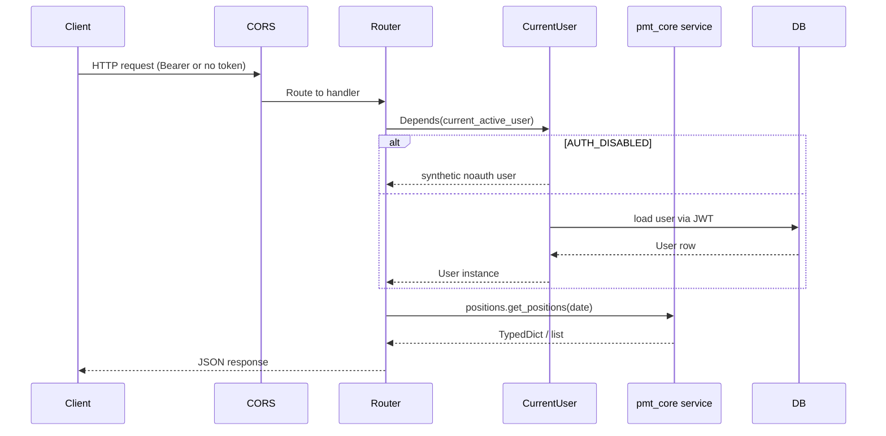
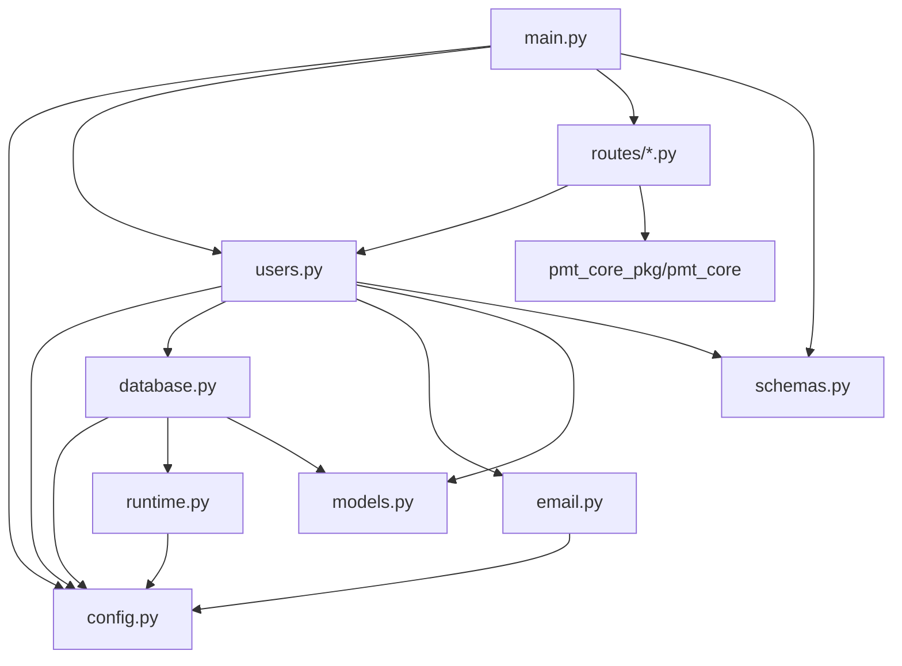

# Backend Architecture

This page documents the FastAPI backend that powers the Portfolio
Management Tool parity rebuild: module layout, request lifecycle,
runtime modes, database layer, authentication, and how the Tauri
desktop sidecar boots.

## Project Structure

```text
fastapi_backend/
├── app/
│   ├── main.py            # FastAPI app, CORS, router registration, pagination
│   ├── config.py          # Settings (Pydantic BaseSettings) loaded from .env / env vars
│   ├── runtime.py         # Runtime helpers: sqlite/postgres URL parsing, desktop bootstrap, alembic
│   ├── database.py        # Async engine, sessions, sqlite PRAGMAs, fastapi-users adapter
│   ├── models.py          # SQLAlchemy ORM (User, Item)
│   ├── schemas.py         # Pydantic schemas (UserRead/Create/Update, ItemBase/Read/Create)
│   ├── users.py           # fastapi-users wiring + AUTH_DISABLED bypass
│   ├── email.py           # Password-reset email via fastapi-mail
│   ├── utils.py           # Route ID helper for clean OpenAPI operation IDs
│   ├── email_templates/   # Jinja2 HTML templates
│   └── routes/
│       ├── _validation.py # Shared query-param validators (date strings, etc.)
│       ├── health.py      # GET /api/health
│       ├── items.py       # Legacy template CRUD under /items
│       ├── positions.py   # /api/positions/*
│       ├── pnl.py         # /api/pnl/*
│       ├── market_data.py # /api/market-data/*
│       ├── risk.py        # /api/risk/*
│       ├── compliance.py  # /api/compliance/*
│       ├── reconciliation.py    # /api/recon/*
│       ├── portfolio_tools.py   # /api/portfolio-tools/*
│       ├── instruments.py # /api/instruments/*
│       ├── events.py      # /api/events/*
│       ├── operations.py  # /api/operations/*
│       ├── orders.py      # /api/orders/*
│       ├── performance.py # /api/performance/*
│       └── notifications.py     # /api/notifications/
├── commands/
│   ├── generate_openapi_schema.py  # Export the live OpenAPI JSON
│   └── run_tauri_sidecar.py        # Entry point used by the PyInstaller sidecar
├── alembic_migrations/    # Alembic environment + revision scripts
├── tests/                 # pytest-asyncio suite
├── alembic.ini            # Alembic configuration
└── pyproject.toml         # Dependencies and tool config
```

## Application Lifecycle

The FastAPI app is created in `app/main.py`:

1. **App construction** - `FastAPI(...)` with
   `generate_unique_id_function=simple_generate_unique_route_id` so
   generated TypeScript client method names stay clean.
2. **CORS middleware** - `CORSMiddleware` wired to `settings.CORS_ORIGINS`.
3. **Auth and user routers** - The five `fastapi-users` routers
   (`auth/jwt`, register, reset-password, verify, users CRUD).
4. **PMT routers** - 14 modules mounted under `/api/*`, plus the legacy
   `/items` and `/api/health`.
5. **Pagination** - `add_pagination(app)` enables
   `fastapi-pagination` for the `/items` list endpoint.

## Runtime Modes

`app/config.py` exposes `RUNTIME_MODE` (read from `PMT_RUNTIME_MODE` /
`PMT_RUNTIME`) with values `"server"` (default) and `"desktop"`.

- **Server mode** is what `pnpm dev` and CI use. The backend is started
  by `uvicorn` and `DATABASE_URL` must be set explicitly (typically
  the local SQLite override or a Postgres URL).
- **Desktop mode** is what the Tauri shell runs. The PyInstaller
  sidecar entry point calls `runtime.ensure_desktop_sidecar_environment()`
  before importing the FastAPI app, which:
  - Creates `~/.portfolio-management-tool/` (override with
    `PMT_APP_DATA_DIR`) and chmods it `0o700`.
  - Materializes a SQLite database at
    `~/.portfolio-management-tool/portfolio-management-tool.sqlite3`.
  - Persists JWT secret keys in `desktop-runtime.json` so they survive
    app restarts.
  - Runs Alembic migrations against the desktop SQLite file.
  - Defaults `PMT_AUTH_DISABLED=true` so the local desktop UX skips
    login.

`/api/health` echoes `runtime` (`"server"` or `"desktop"`) and the
detected `database_backend` (`"sqlite"` / `"postgresql"`), which is the
quickest way to confirm the mode that is actually running.

## Request Flow



Most PMT routes are **read-only** wrappers around `pmt_core` services.
The User dependency only gates access; route logic does not consult
the SQL database for PMT data because mock data ships from `pmt_core`
by default (`MOCK_DATA=true`). The `/auth/*`, `/users/*`, and
`/items/*` routers do hit the SQL database.

## Module Dependencies



`pmt_core_pkg/pmt_core` is the source of truth for PMT domain models
and business logic; route handlers stay thin.

## Database Layer

`app/database.py` builds an async SQLAlchemy engine from
`settings.DATABASE_URL` after passing it through
`runtime.normalize_async_database_url`. The driver is selected from the
URL backend:

| Backend | Async driver | Engine kwargs |
|---|---|---|
| `postgresql` | `postgresql+asyncpg` | `poolclass=NullPool` (serverless-safe) |
| `sqlite` | `sqlite+aiosqlite` | `connect_args={"timeout": 30}` |

For SQLite, a connection-time event listener applies PMT's pragmas:

```python
PRAGMA foreign_keys=ON
PRAGMA busy_timeout=5000
PRAGMA journal_mode=WAL
PRAGMA synchronous=NORMAL
```

`get_async_session` is the FastAPI dependency that yields a session per
request. `get_user_db` wraps the session with `SQLAlchemyUserDatabase`
for `fastapi-users`. `create_db_and_tables` is used by tests; production
schema is managed by Alembic.

### Migrations

```bash
cd fastapi_backend
uv run alembic revision --autogenerate -m "describe change"
uv run alembic upgrade head
```

`alembic.ini` and `alembic_migrations/env.py` live alongside the app.
The desktop sidecar invokes `runtime.run_migrations_to_head()` at
startup so a fresh installation gets the schema without manual setup.

## Models

`app/models.py` extends `Base` (a `DeclarativeBase`).

### User

`User(SQLAlchemyBaseUserTableUUID, Base)` adds the standard
`fastapi-users` columns: `id` (UUID), `email`, `hashed_password`,
`is_active`, `is_superuser`, `is_verified`. It owns a one-to-many
`items` relationship with `cascade="all, delete-orphan"`.

### Item

The `items` table is a legacy template surface. PMT domain data does
not have its own ORM tables - it is served directly from `pmt_core`
services.

| Column | Type | Notes |
|---|---|---|
| `id` | `UUID` | primary key, default `uuid4` |
| `name` | `String` | required |
| `description` | `String` | optional |
| `quantity` | `Integer` | optional |
| `user_id` | `UUID` | FK to `user.id` |

## Authentication

`app/users.py` wires `fastapi-users` with a JWT backend.

- **Transport** - `PMTBearerTransport` (a `BearerTransport` subclass
  that returns `200 {"detail": "Successfully logged out"}` on logout).
- **Strategy** - `JWTStrategy(secret=ACCESS_SECRET_KEY,
  lifetime_seconds=ACCESS_TOKEN_EXPIRE_SECONDS)`.
- **Backend name** - `"jwt"`.

### `current_active_user`

PMT does not use `fastapi-users.current_user` directly. Instead, it
wraps `fastapi_users.current_user(active=True, optional=True)`:

```python
async def current_active_user(
    user: Optional[User] = Depends(_optional_current_user),
) -> User:
    if settings.AUTH_DISABLED:
        return _build_noauth_user()
    if user is None:
        raise HTTPException(status_code=401)
    return user
```

When `AUTH_DISABLED` (alias `PMT_AUTH_DISABLED`) is true, every route
sees a synthetic user with id `00000000-0000-0000-0000-0000000000a1`,
which is what the local web and desktop workflows rely on.

`AUTH_DISABLED` defaults to **true** in the application code, but the
test suite forces it back to false in `tests/conftest.py` so 401
assertions stay meaningful. Committed `.env.example` files match the
test default.

### Password rules

`UserManager.validate_password` enforces:

- Minimum 8 characters.
- Must not contain the user's email address.
- At least one uppercase letter.
- At least one special character from `!@#$%^&*(),.?":{}|<>`.

## Email

`app/email.py` configures `fastapi-mail` from the `MAIL_*` settings
and ships one Jinja2 template (`password_reset.html`). The reset link
points at `{FRONTEND_URL}/password-recovery/confirm?token=...`.

In local SQLite/no-auth mode the reset flow is not used. Authenticated
workflows require an SMTP server reachable via the `MAIL_*` settings.

## OpenAPI Schema

The OpenAPI schema is the contract between FastAPI and the Next.js
client.

1. **Live schema** - `GET /openapi.json` is served by FastAPI itself.
2. **Export script** - `uv run python -m commands.generate_openapi_schema`
   writes the schema to `OPENAPI_OUTPUT_FILE`.
3. **Frontend consumption** - `pnpm generate-client` (run from
   `nextjs-frontend/`) pulls the live schema and regenerates
   `app/openapi-client/`. Do not hand-edit those files.

## Configuration

Settings are loaded by `app/config.py` from environment variables and
`fastapi_backend/.env`.

| Group | Variable | Type | Default | Notes |
|---|---|---|---|---|
| OpenAPI | `OPENAPI_URL` | `str` | `/openapi.json` | path the schema is served at |
| Database | `DATABASE_URL` | `str` | required | SQLite or Postgres URL |
| | `TEST_DATABASE_URL` | `str?` | `None` | optional override for pytest |
| | `EXPIRE_ON_COMMIT` | `bool` | `False` | SQLAlchemy session behavior |
| Auth | `ACCESS_SECRET_KEY` | `str` | required | JWT signing secret |
| | `RESET_PASSWORD_SECRET_KEY` | `str` | required | reset-token secret |
| | `VERIFICATION_SECRET_KEY` | `str` | required | email-verify secret |
| | `ALGORITHM` | `str` | `HS256` | JWT algorithm |
| | `ACCESS_TOKEN_EXPIRE_SECONDS` | `int` | `3600` | token lifetime |
| | `AUTH_DISABLED` (`PMT_AUTH_DISABLED`) | `bool` | `True` | bypass auth in local mode |
| Email | `MAIL_USERNAME`, `MAIL_PASSWORD`, `MAIL_FROM`, `MAIL_SERVER`, `MAIL_PORT` | mixed | `None` | SMTP wiring |
| | `MAIL_FROM_NAME` | `str` | `Portfolio Management Tool` | sender display name |
| | `MAIL_STARTTLS` / `MAIL_SSL_TLS` | `bool` | `True` / `False` | TLS posture |
| | `USE_CREDENTIALS`, `VALIDATE_CERTS` | `bool` | `True` | fastapi-mail flags |
| | `TEMPLATE_DIR` | `str` | `email_templates` | templates folder |
| Frontend | `FRONTEND_URL` | `str` | `http://localhost:3000` | used in reset emails |
| Runtime | `RUNTIME_MODE` (`PMT_RUNTIME_MODE`/`PMT_RUNTIME`) | `Literal[server, desktop]` | `server` | reported by `/api/health` |
| | `APP_DATA_DIR` (`PMT_APP_DATA_DIR`/`PMT_DESKTOP_APP_DATA_DIR`) | `str?` | `None` | desktop app data dir |
| | `MOCK_DATA` | `bool` | `True` | use mock data from `pmt_core` |
| CORS | `CORS_ORIGINS` | `Set[str]` | required | JSON array or comma-separated |

Strings parsed by `parse_cors_origins` accept JSON arrays
(`["http://localhost:3000"]`) and comma-separated lists.
