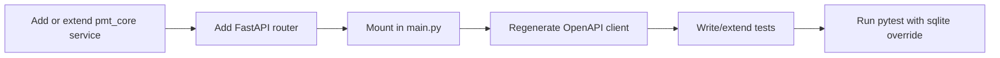

# Backend Development Guide

This guide covers the day-to-day work of changing the FastAPI backend
in the Portfolio Management Tool parity rebuild: adding routes,
extending shared business logic, working with the database, writing
tests, and keeping the OpenAPI client in sync. For high-level
structure and runtime modes, see
[Backend Architecture](backend-architecture.md).

---

## Where Logic Lives

Most PMT routes are read-only thin wrappers around services in
`pmt_core_pkg/pmt_core`. The decision tree:

| Concern | Owner |
|---|---|
| Domain models, calculations, mock data | `pmt_core_pkg/pmt_core` |
| HTTP shape (path, query params, status codes) | `fastapi_backend/app/routes/` |
| Auth, sessions, CORS, OpenAPI plumbing | `fastapi_backend/app/{users,database,main}.py` |
| Persistent SQL tables (`User`, `Item`) | `fastapi_backend/app/models.py` |
| Frontend bindings | regenerated from OpenAPI - never hand-edit |

Adding a new module almost always means: add or extend a service in
`pmt_core`, then add a router that exposes it.

---

## Adding a New PMT Route

The pattern below is what `app/routes/positions.py` and the other 13
PMT routers follow.

### 1. Implement the service in `pmt_core`

```python
# pmt_core_pkg/pmt_core/services/example.py
from datetime import date
from typing import Optional


class ExampleService:
    async def get_examples(self, on: Optional[date]) -> list[dict]:
        # business logic, mock data, or repository calls
        return [...]
```

Expose it from `pmt_core/services/__init__.py` if it should be part of
the public surface.

### 2. Add a FastAPI router

```python
# fastapi_backend/app/routes/example.py
from typing import Optional

from fastapi import APIRouter, Depends, Query

from app.database import User
from app.users import current_active_user
from app.routes._validation import validate_date
from pmt_core.services.example import ExampleService

router = APIRouter(tags=["example"])

example_service = ExampleService()


@router.get("/")
async def get_examples(
    position_date: Optional[str] = Query(None, description="YYYY-MM-DD"),
    user: User = Depends(current_active_user),
):
    on = validate_date(position_date, "position_date")
    return await example_service.get_examples(on)
```

`current_active_user` is the project's wrapper around
`fastapi-users.current_user`: it returns a synthetic user when
`AUTH_DISABLED` is on and raises 401 otherwise. Use it on every PMT
route - even if the no-auth default makes it look optional, the test
suite re-enables auth and will fail otherwise.

### 3. Mount the router in `main.py`

```python
from app.routes.example import router as example_router

app.include_router(example_router, prefix="/api/example")
```

Match the URL convention of the other 14 routers (`/api/<kebab-case>`).

### 4. Regenerate the OpenAPI client

After the route change, with the backend running:

```bash
cd nextjs-frontend
pnpm generate-client
```

This refreshes `openapi.json` and `app/openapi-client/`. Do not
hand-edit those files; the generator overwrites them.

---

## Adding a Persistent ORM Model

Most PMT data is read-only mock data from `pmt_core` and does not need
new tables. Use this path only when introducing genuinely persistent
data (the `Item` template surface is the existing example).

### 1. Define the model

```python
# fastapi_backend/app/models.py
from sqlalchemy import Column, ForeignKey, Integer, String
from sqlalchemy.orm import relationship
from fastapi_users_db_sqlalchemy.generics import GUID
from uuid import uuid4


class Note(Base):
    __tablename__ = "notes"

    id = Column(GUID(), primary_key=True, default=uuid4)
    body = Column(String, nullable=False)
    user_id = Column(GUID(), ForeignKey("user.id"), nullable=False)

    user = relationship("User", back_populates="notes")
```

Add the reverse relationship on `User`:

```python
class User(SQLAlchemyBaseUserTableUUID, Base):
    items = relationship("Item", back_populates="user", cascade="all, delete-orphan")
    notes = relationship("Note", back_populates="user", cascade="all, delete-orphan")
```

### 2. Generate and review the migration

```bash
cd fastapi_backend
uv run alembic revision --autogenerate -m "add notes table"
```

Inspect the file under `alembic_migrations/versions/` before applying
it. Autogenerate sometimes misses table renames or default-value
tweaks.

### 3. Apply the migration

```bash
uv run alembic upgrade head
```

For SQLite-backed dev/desktop work, `runtime.run_migrations_to_head()`
will pick up the new revision automatically on next backend start.

---

## Pydantic Schemas

Schemas live in `app/schemas.py`. The existing PMT routes return
`pmt_core` TypedDicts directly without a separate Pydantic layer - that
is intentional and keeps the OpenAPI surface aligned with the Reflex
reference. Add Pydantic schemas only when:

- A handler needs validated request bodies (`POST` / `PATCH`).
- A response shape diverges from the underlying TypedDict.

```python
class NoteCreate(BaseModel):
    body: str

class NoteRead(BaseModel):
    id: UUID
    body: str
    user_id: UUID

    model_config = {"from_attributes": True}
```

---

## Tests

Tests use `pytest` with `pytest-asyncio` and `httpx.AsyncClient`. The
suite forces auth on (`AUTH_DISABLED=False`) globally so 401 / 403
assertions stay meaningful even though the application defaults to
no-auth for local dev.

### Fixtures

`tests/conftest.py` provides:

| Fixture | Purpose |
|---|---|
| `require_auth_by_default_in_tests` (autouse) | Sets `AUTH_DISABLED=False` for the duration of each test |
| `engine` | Fresh async engine bound to `TEST_DATABASE_URL`, with `Base.metadata.create_all` and `drop_all` per function |
| `db_session` | Per-test `AsyncSession` that rolls back on exit |
| `test_client` | `httpx.AsyncClient` wired to the FastAPI app with `get_async_session` and `get_user_db` overridden to use `db_session` |
| `authenticated_user` | Creates a verified test user, returns `{ headers, user, user_data }` with a valid JWT bearer token |

### Writing a test

```python
import pytest


@pytest.mark.asyncio
async def test_get_examples_requires_auth(test_client):
    response = await test_client.get("/api/example/")
    assert response.status_code == 401


@pytest.mark.asyncio
async def test_get_examples_authenticated(test_client, authenticated_user):
    response = await test_client.get(
        "/api/example/",
        headers=authenticated_user["headers"],
    )
    assert response.status_code == 200
```

### Running tests

```bash
cd fastapi_backend

# SQLite-backed test DB (default for parity work)
TEST_DATABASE_URL=sqlite+aiosqlite:///$(pwd)/.pytest-sqlite.sqlite3 \
  ./.venv/bin/python -m pytest -q

# Single file
TEST_DATABASE_URL=sqlite+aiosqlite:///$(pwd)/.pytest-sqlite.sqlite3 \
  ./.venv/bin/python -m pytest tests/routes/test_positions.py -q
```

Last known result on `feat/nextjs-fastapi-rebuild`: **187 passed, 2
skipped**. Cite exact counts when reporting verification - never just
"green".

---

## Configuration

### Adding a new setting

1. Add the field to `Settings` in `app/config.py`:

   ```python
   class Settings(BaseSettings):
       MY_NEW_SETTING: str = "default_value"
   ```

   Use `Field(..., validation_alias=AliasChoices("PMT_FOO", "FOO"))`
   when you want both an unprefixed and a `PMT_`-prefixed env name.

2. Document the env var in `fastapi_backend/.env.example`. Never check
   in real secrets; use placeholders.

3. Read it at runtime:

   ```python
   from app.config import settings

   print(settings.MY_NEW_SETTING)
   ```

### Type coercion

Pydantic `BaseSettings` coerces env values automatically:

| Python type | Env value | Example |
|---|---|---|
| `str` | plain string | `MY_VAR=hello` |
| `int` | numeric | `MY_VAR=42` |
| `bool` | `true`/`false`/`1`/`0` | `MY_VAR=true` |
| `Set[str]` | JSON array or comma list | `MY_VAR=["a","b"]` |
| `str \| None` | unset or empty | `MY_VAR=` |

`CORS_ORIGINS` accepts either form via `runtime.parse_cors_origins`.

---

## OpenAPI and the Frontend

The `nextjs-frontend/app/openapi-client/` tree is generated from a
**running** backend. The flow:

```bash
# Terminal A - running backend
cd fastapi_backend
DATABASE_URL=sqlite+aiosqlite:///$(pwd)/.pmt-dev.sqlite3 \
  ./.venv/bin/python -m uvicorn app.main:app --host 127.0.0.1 --port 8000 --reload

# Terminal B - regenerate client
cd nextjs-frontend
pnpm generate-client
```

Re-run `pnpm generate-client` whenever:

- Any route signature, query param, request body, or response shape changes.
- An auth dependency is added or removed.
- A new router is mounted in `main.py`.
- A `pmt_core` TypedDict referenced by a response model changes shape.

`watcher.py` does the same job locally during `start.sh`-driven dev
sessions: it runs mypy and re-exports the JSON schema to
`OPENAPI_OUTPUT_FILE` whenever `app/main.py`, `app/schemas.py`, or any
file under `app/routes/` is saved.

---

## Development Workflow Summary



1. Implement business logic in `pmt_core_pkg/pmt_core`.
2. Wrap it in a router under `fastapi_backend/app/routes/`.
3. Mount the router in `app/main.py`.
4. With the backend running, regenerate the OpenAPI client.
5. Add or extend tests in `fastapi_backend/tests/`.
6. Run `pytest -q` against a SQLite test DB and cite the exact counts.

For frontend-side wiring of the regenerated client, see
[`docs/nextjs-frontend/walkthrough.md`](../nextjs-frontend/walkthrough.md).
